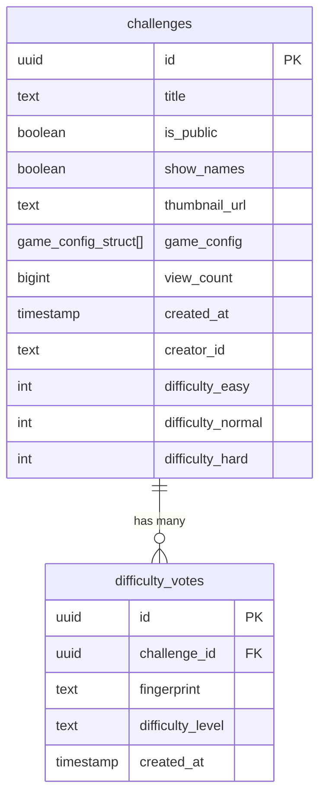
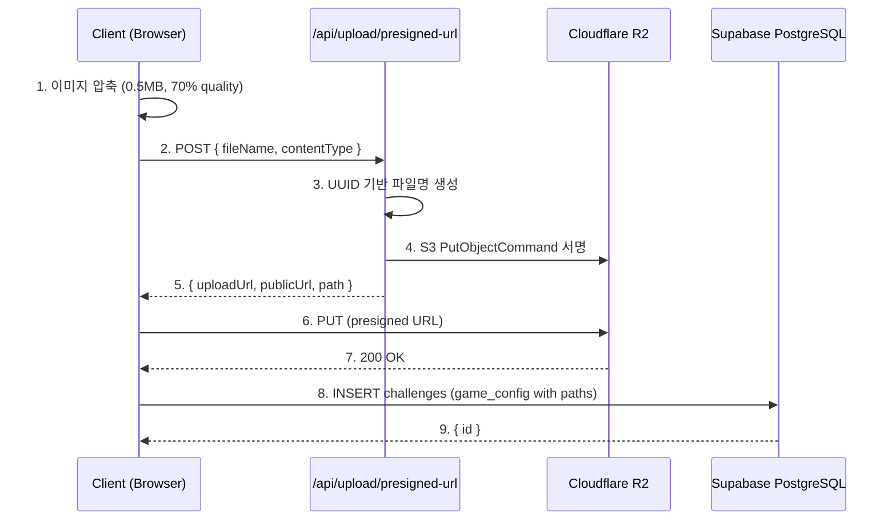

# 데이터베이스 및 스토리지 아키텍처

> **Say The Word On Beat KR** 프로젝트의 데이터베이스와 스토리지 구조에 대한 상세 기술 문서

## 목차

- [1. 소개 및 개요](#1-소개-및-개요)
- [2. 데이터베이스 스키마](#2-데이터베이스-스키마)
- [3. 스토리지 아키텍처](#3-스토리지-아키텍처)
- [4. 데이터 접근 패턴](#4-데이터-접근-패턴)
- [5. 보안 및 RLS 정책](#5-보안-및-rls-정책)
- [6. 타입 안전성 아키텍처](#6-타입-안전성-아키텍처)
- [7. 주요 설계 패턴](#7-주요-설계-패턴)
- [8. 환경 설정 및 마이그레이션](#8-환경-설정-및-마이그레이션)
- [9. 실전 코드 예제](#9-실전-코드-예제)
- [10. 참고 파일 경로](#10-참고-파일-경로)

---

## 1. 소개 및 개요

### 프로젝트 소개

**Say The Word On Beat KR**는 사용자가 이미지를 8비트 슬롯에 매핑하여 "박자에 맞춰 말하기" 챌린지를 만들고 공유하는 리듬 기반 웹 게임입니다.

### 기술 스택

- **Database**: Supabase PostgreSQL 17
- **Storage**: Cloudflare R2 (Supabase Storage에서 마이그레이션)
- **Framework**: Next.js 16.1.0 (App Router) with React 19
- **Type Safety**: TypeScript 5 + Auto-generated DB types
- **Data Fetching**: React Query (TanStack Query)

### 문서의 목적

이 문서는 개발자가 다음을 이해할 수 있도록 돕습니다:

- 데이터베이스 스키마 구조와 각 테이블/함수의 역할
- 이미지 스토리지 업로드 및 조회 플로우
- 데이터 접근 패턴 및 타입 변환 로직
- 보안 정책 (RLS) 및 권한 관리
- 실전 코드 예제를 통한 실무 적용

---

## 2. 데이터베이스 스키마

### 2.1 테이블 구조

#### `challenges` 테이블

챌린지의 모든 정보를 저장하는 핵심 테이블입니다.

| 컬럼명              | 타입                   | 제약조건    | 기본값              | 설명                                  |
| ------------------- | ---------------------- | ----------- | ------------------- | ------------------------------------- |
| `id`                | UUID                   | PRIMARY KEY | `gen_random_uuid()` | 챌린지 고유 ID                        |
| `title`             | TEXT                   | NOT NULL    | -                   | 챌린지 제목                           |
| `is_public`         | BOOLEAN                | NOT NULL    | `false`             | 공개 여부 (true: 공개, false: 비공개) |
| `show_names`        | BOOLEAN                | NOT NULL    | `true`              | 슬롯에 텍스트 표시 여부               |
| `thumbnail_url`     | TEXT                   | NULLABLE    | `NULL`              | 썸네일 이미지 경로 (상대 경로)        |
| `game_config`       | `game_config_struct[]` | NOT NULL    | -                   | 게임 구성 (5라운드 × 8슬롯)           |
| `view_count`        | BIGINT                 | NOT NULL    | `0`                 | 조회수 (플레이 횟수)                  |
| `created_at`        | TIMESTAMPTZ            | NOT NULL    | `now()`             | 생성 시각                             |
| `creator_id`        | TEXT                   | NULLABLE    | `NULL`              | 생성자 ID (브라우저 fingerprint)      |
| `difficulty_easy`   | INTEGER                | NULLABLE    | `0`                 | "쉬움" 난이도 투표 수                 |
| `difficulty_normal` | INTEGER                | NULLABLE    | `0`                 | "보통" 난이도 투표 수                 |
| `difficulty_hard`   | INTEGER                | NULLABLE    | `0`                 | "어려움" 난이도 투표 수               |

**인덱스**:

- `idx_challenges_creator_id`: creator_id 기반 빠른 조회
- `idx_challenges_difficulty_stats`: 난이도 통계 조회 최적화

#### `difficulty_votes` 테이블

사용자의 난이도 투표를 저장합니다.

| 컬럼명             | 타입        | 제약조건                                       | 기본값              | 설명                        |
| ------------------ | ----------- | ---------------------------------------------- | ------------------- | --------------------------- |
| `id`               | UUID        | PRIMARY KEY                                    | `gen_random_uuid()` | 투표 고유 ID                |
| `challenge_id`     | UUID        | FOREIGN KEY → `challenges.id` (CASCADE DELETE) | -                   | 투표 대상 챌린지            |
| `fingerprint`      | TEXT        | NOT NULL                                       | -                   | 투표자 브라우저 fingerprint |
| `difficulty_level` | TEXT        | CHECK (`easy`, `normal`, `hard`)               | -                   | 선택한 난이도               |
| `created_at`       | TIMESTAMPTZ | NULLABLE                                       | `now()`             | 투표 시각                   |

**제약조건**:

- **UNIQUE** (`challenge_id`, `fingerprint`): 챌린지당 사용자 1회만 투표 가능
- **CHECK**: `difficulty_level IN ('easy', 'normal', 'hard')`

**인덱스**:

- `idx_difficulty_votes_challenge_id`: challenge_id 기반 빠른 조회
- `idx_difficulty_votes_fingerprint`: fingerprint 기반 사용자 투표 추적

---

### 2.2 복합 타입 (Composite Types)

PostgreSQL의 복합 타입을 사용하여 중첩된 JSON 구조를 타입 안전하게 관리합니다.

#### `beat_slot`

각 비트 슬롯의 이미지와 텍스트 정보를 담는 타입입니다.

```sql
CREATE TYPE public.beat_slot AS (
  "imagePath" TEXT,      -- R2 스토리지의 상대 경로 (예: "abc-123.jpg")
  "displayText" TEXT     -- 슬롯에 표시할 텍스트 (show_names=true일 때만 사용)
);
```

**필드 설명**:

- `imagePath`: Cloudflare R2에 저장된 이미지의 상대 경로. NULL이면 빈 슬롯
- `displayText`: 슬롯에 표시할 텍스트 (정답). `show_names=false`면 NULL

#### `game_config_struct`

각 라운드의 구성을 담는 타입입니다.

```sql
CREATE TYPE public.game_config_struct AS (
  "roundIndex" INTEGER,  -- 라운드 번호 (0-4)
  "slots" beat_slot[]    -- 8개의 슬롯 배열 (고정 길이)
);
```

**구조**:

- 각 챌린지는 **5개의 라운드** (`game_config[0..4]`)
- 각 라운드는 **8개의 슬롯** (`slots[0..7]`)
- 총 **40개의 슬롯** (5 rounds × 8 slots)

**게임 로직 연관성**:

- 오디오 BPM과 동기화하여 8비트마다 슬롯 활성화
- `roundIndex`로 현재 라운드 추적
- 빈 슬롯 (`imagePath: null`)은 건너뜀

---

### 2.3 데이터베이스 함수

#### `increment_view_count(row_id UUID)`

챌린지 조회수를 원자적으로(atomic) 증가시킵니다.

```sql
CREATE OR REPLACE FUNCTION public.increment_view_count(row_id UUID)
RETURNS void
LANGUAGE plpgsql
SECURITY DEFINER
SET search_path TO 'public', 'pg_temp'
AS $$
BEGIN
  UPDATE public.challenges
  SET view_count = view_count + 1
  WHERE id = row_id;
END;
$$;
```

**특징**:

- **SECURITY DEFINER**: postgres 권한으로 실행 (RLS 우회)
- **Atomic 업데이트**: 동시 요청에도 정확한 카운팅 보장
- **search_path 고정**: SQL injection 방지

**사용 예제**:

```typescript
// src/entities/challenge/api/repository.ts
export async function incrementViewCount(id: string): Promise<void> {
  const { error } = await supabase.rpc("increment_view_count", {
    row_id: id,
  });

  if (error) {
    console.error("Failed to increment view count:", error);
  }
}
```

#### `get_challenge_with_ownership(challenge_id UUID, user_id TEXT)`

챌린지 정보를 조회하면서 소유권 여부를 계산합니다.

**목적**: `creator_id`를 클라이언트에 노출하지 않고 "내 챌린지인지" 판별

```sql
CREATE OR REPLACE FUNCTION public.get_challenge_with_ownership(
  challenge_id UUID,
  user_id TEXT DEFAULT NULL
)
RETURNS TABLE (
  id UUID,
  title TEXT,
  is_public BOOLEAN,
  show_names BOOLEAN,
  thumbnail_url TEXT,
  view_count INTEGER,
  created_at TIMESTAMPTZ,
  difficulty_easy INTEGER,
  difficulty_normal INTEGER,
  difficulty_hard INTEGER,
  game_config JSONB,
  is_mine BOOLEAN
)
LANGUAGE plpgsql
SECURITY DEFINER
AS $$
BEGIN
  RETURN QUERY
  SELECT
    c.id,
    c.title,
    c.is_public,
    c.show_names,
    c.thumbnail_url,
    c.view_count::integer,
    c.created_at,
    c.difficulty_easy,
    c.difficulty_normal,
    c.difficulty_hard,
    row_to_json(c.game_config)::jsonb AS game_config,
    (c.creator_id = user_id) AS is_mine
  FROM public.challenges c
  WHERE c.id = challenge_id;
END;
$$;
```

**보안 메커니즘**:

1. `creator_id`는 반환되지 않음
2. `is_mine` 필드는 서버에서 계산 (클라이언트는 결과만 수신)
3. 클라이언트가 다른 사용자의 `creator_id`를 알 수 없음

#### `update_difficulty_stats()` 트리거 함수

투표가 생성/수정/삭제될 때 자동으로 `challenges` 테이블의 난이도 통계를 업데이트합니다.

```sql
CREATE OR REPLACE FUNCTION public.update_difficulty_stats()
RETURNS TRIGGER
LANGUAGE plpgsql
AS $$
BEGIN
  -- INSERT or UPDATE
  IF (TG_OP = 'INSERT' OR TG_OP = 'UPDATE') THEN
    UPDATE challenges
    SET
      difficulty_easy = (SELECT COUNT(*) FROM difficulty_votes WHERE challenge_id = NEW.challenge_id AND difficulty_level = 'easy'),
      difficulty_normal = (SELECT COUNT(*) FROM difficulty_votes WHERE challenge_id = NEW.challenge_id AND difficulty_level = 'normal'),
      difficulty_hard = (SELECT COUNT(*) FROM difficulty_votes WHERE challenge_id = NEW.challenge_id AND difficulty_level = 'hard')
    WHERE id = NEW.challenge_id;
  END IF;

  -- DELETE
  IF (TG_OP = 'DELETE') THEN
    UPDATE challenges
    SET
      difficulty_easy = (SELECT COUNT(*) FROM difficulty_votes WHERE challenge_id = OLD.challenge_id AND difficulty_level = 'easy'),
      difficulty_normal = (SELECT COUNT(*) FROM difficulty_votes WHERE challenge_id = OLD.challenge_id AND difficulty_level = 'normal'),
      difficulty_hard = (SELECT COUNT(*) FROM difficulty_votes WHERE challenge_id = OLD.challenge_id AND difficulty_level = 'hard')
    WHERE id = OLD.challenge_id;
  END IF;

  RETURN NEW;
END;
$$;

-- 트리거 생성
CREATE TRIGGER difficulty_vote_stats_trigger
AFTER INSERT OR UPDATE OR DELETE ON difficulty_votes
FOR EACH ROW
EXECUTE FUNCTION update_difficulty_stats();
```

**작동 원리**:

1. 사용자가 투표 → `difficulty_votes` 테이블에 INSERT/UPDATE
2. 트리거 자동 실행 → `challenges` 테이블의 카운터 재계산
3. 클라이언트는 `challenges` 테이블만 조회하면 최신 통계 확인 가능

#### `delete_old_private_challenges()` 스케줄 함수

48시간 이상 된 비공개 챌린지를 자동으로 삭제합니다.

```sql
CREATE OR REPLACE FUNCTION public.delete_old_private_challenges()
RETURNS void
LANGUAGE plpgsql
SECURITY DEFINER
AS $$
DECLARE
  old_challenge RECORD;
  image_path TEXT;
BEGIN
  FOR old_challenge IN
    SELECT id, game_config, thumbnail_url
    FROM challenges
    WHERE is_public = false
      AND created_at < NOW() - INTERVAL '48 hours'
  LOOP
    -- Delete images from R2 storage
    FOR image_path IN
      SELECT DISTINCT (slot->>'imagePath')::TEXT
      FROM jsonb_array_elements(old_challenge.game_config::jsonb) AS round,
           jsonb_array_elements(round->'slots') AS slot
      WHERE slot->>'imagePath' IS NOT NULL
    LOOP
      PERFORM storage.delete_object('challenge-images', image_path);
    END LOOP;

    -- Delete thumbnail if exists
    IF old_challenge.thumbnail_url IS NOT NULL THEN
      PERFORM storage.delete_object('challenge-images', old_challenge.thumbnail_url);
    END IF;

    -- Delete challenge record (CASCADE deletes difficulty_votes)
    DELETE FROM challenges WHERE id = old_challenge.id;
  END LOOP;
END;
$$;

-- pg_cron 스케줄 (Supabase Pro+)
SELECT cron.schedule(
  'delete-old-private-challenges',
  '0 * * * *',  -- 매 시간 정각마다 실행
  'SELECT delete_old_private_challenges();'
);
```

**스케줄 정책**:

- **실행 주기**: 매 시간 정각 (pg_cron 사용)
- **삭제 대상**: `is_public = false AND created_at < NOW() - 48h`
- **CASCADE 삭제**: 스토리지 이미지 + DB 레코드 + 관련 투표 모두 삭제

---

### 2.4 ER 다이어그램



---

## 3. 스토리지 아키텍처

### 3.1 Cloudflare R2 설정

**기본 정보**:

- **버킷 이름**: `say-the-word-on-beat-challenge-images`
- **Public URL**: `https://pub-9bfc86be376d423e94527f0c24e634f8.r2.dev`
- **저장 방식**: 상대 경로 (예: `abc-123.jpg`)
- **CDN 캐싱**: `Cache-Control: public, max-age=31536000, immutable` (1년)

**Supabase Storage에서 마이그레이션한 이유**:

1. **비용 효율성**: Cloudflare R2는 egress(다운로드) 비용 무료
2. **성능**: 글로벌 CDN 자동 적용
3. **확장성**: 무제한 스토리지 용량

**마이그레이션 이력**:

- 초기: Supabase Storage (`challenge-images` 버킷)
- 현재: Cloudflare R2 (Presigned URL 패턴 유지)
- Legacy 코드: `supabase/migrations/20251226050000_create_storage_bucket.sql` (deprecated)

---

### 3.2 이미지 업로드 플로우

#### Presigned URL 패턴

**보안 원칙**: 클라이언트는 R2 서비스 키를 절대 알 수 없어야 함

**플로우**:



**단계별 설명**:

1. **클라이언트 측 압축**:

   - 라이브러리: `browser-image-compression`
   - 옵션: `maxSizeMB: 0.5`, `quality: 0.7`, `maxWidthOrHeight: 1280`
   - Web Worker 사용 (논블로킹 처리)

2. **Presigned URL 요청**:

   - 엔드포인트: `POST /api/upload/presigned-url`
   - 파라미터: `{ fileName: string, contentType: string }`

3. **서버 측 서명**:

   - AWS SDK S3Client로 R2 연결
   - UUID 기반 고유 파일명 생성 (예: `550e8400-e29b-41d4-a716-446655440000.jpg`)
   - 60초 만료 시간 설정

4. **클라이언트 직접 업로드**:

   - Presigned URL로 PUT 요청
   - R2가 서명 검증 후 파일 저장
   - 서버 리소스 사용 없음 (대역폭 절약)

5. **DB 저장**:
   - 상대 경로만 저장 (`uuid.jpg`)
   - 전체 URL은 조회 시 동적 생성

#### 클라이언트 측 이미지 압축

**파일**: [src/shared/lib/image/compression.ts](src/shared/lib/image/compression.ts)

```typescript
import imageCompression from "browser-image-compression";

const COMPRESSION_OPTIONS = {
  maxSizeMB: 0.5, // 최대 500KB
  maxWidthOrHeight: 1280, // 최대 1280px
  quality: 0.7, // 70% JPEG 품질
  useWebWorker: true, // Web Worker 사용
};

export async function compressImage(file: File): Promise<File> {
  return await imageCompression(file, COMPRESSION_OPTIONS);
}
```

**압축 효과**:

- 원본: 평균 3-5MB
- 압축 후: 평균 200-400KB
- 품질 저하: 육안으로 거의 구분 불가

#### 보안 고려사항

1. **서비스 키 보호**:

   - `R2_ACCESS_KEY_ID`, `R2_SECRET_ACCESS_KEY`는 서버 측 환경변수
   - 클라이언트는 절대 접근 불가

2. **Presigned URL 만료**:

   - 60초 후 자동 만료
   - 토큰 탈취 리스크 최소화

3. **파일 타입 검증**:

   - 서버에서 `contentType` 검증 (이미지만 허용)
   - 악성 파일 업로드 차단

4. **캐싱 전략**:
   - `Cache-Control: public, max-age=31536000, immutable`
   - CDN에서 1년간 캐싱 (불변 파일)
   - UUID 파일명으로 캐시 충돌 방지

---

### 3.3 이미지 경로 전략

#### DB 저장: 상대 경로만

```typescript
// 데이터베이스에 저장되는 형태
{
  game_config: [
    {
      roundIndex: 0,
      slots: [
        {
          imagePath: "550e8400-e29b-41d4-a716-446655440000.jpg",
          displayText: "고양이",
        },
        {
          imagePath: "661f9511-f3ac-52e5-b827-557766551111.jpg",
          displayText: "강아지",
        },
        // ...
      ],
    },
  ];
}
```

#### 런타임 변환: 전체 URL 생성

```typescript
// 클라이언트에서 조회할 때 변환
const r2PublicUrl = process.env.NEXT_PUBLIC_R2_PUBLIC_URL;
const fullUrl = `${r2PublicUrl}/${imagePath}`;
// 결과: "https://pub-9bfc86be376d423e94527f0c24e634f8.r2.dev/550e8400-e29b-41d4-a716-446655440000.jpg"
```

#### 썸네일 폴백 로직

**파일**: [src/entities/challenge/api/repository.ts](src/entities/challenge/api/repository.ts:8-31)

```typescript
export function convertImagePathToUrl(
  challenge: Pick<ClientSafeChallenge, "thumbnail_url" | "game_config">
): string {
  // 1. 우선순위: thumbnail_url
  let imagePath = challenge.thumbnail_url;

  // 2. 폴백: 첫 라운드의 첫 슬롯 이미지
  if (!imagePath) {
    const gameConfig = challenge.game_config;
    imagePath = gameConfig?.[0]?.slots?.[0]?.imagePath ?? null;
  }

  // 3. R2 URL 변환
  if (imagePath) {
    const r2PublicUrl = process.env.NEXT_PUBLIC_R2_PUBLIC_URL;
    if (!r2PublicUrl) {
      console.error("NEXT_PUBLIC_R2_PUBLIC_URL is not defined");
      return "/placeholder.svg";
    }
    return `${r2PublicUrl}/${imagePath}`;
  }

  // 4. 최종 폴백: 플레이스홀더
  return "/placeholder.svg";
}
```

**폴백 우선순위**:

1. `thumbnail_url` (명시적으로 지정된 썸네일)
2. `game_config[0].slots[0].imagePath` (첫 슬롯 이미지)
3. `/placeholder.svg` (기본 이미지)

---

## 4. 데이터 접근 패턴

### 4.1 Repository Layer (Entity)

**파일**: [src/entities/challenge/api/repository.ts](src/entities/challenge/api/repository.ts)

#### 주요 함수

| 함수명                          | 메서드      | 용도                               | 반환 타입                  |
| ------------------------------- | ----------- | ---------------------------------- | -------------------------- |
| `createChallenge()`             | REST INSERT | 챌린지 생성                        | `{ id: string }`           |
| `getChallengeById()`            | RPC         | 챌린지 조회 + 소유권 확인          | `ClientSafeChallenge`      |
| `incrementViewCount()`          | RPC         | 조회수 증가                        | `void`                     |
| `getPopularChallenges()`        | REST SELECT | 인기 챌린지 목록 (view_count DESC) | `Array<ChallengeListItem>` |
| `getAllChallenges()`            | REST SELECT | 전체 공개 챌린지 (페이지네이션)    | `Array<ChallengeListItem>` |
| `getMyChallenges()`             | REST SELECT | 내 챌린지 목록 (creator_id 필터)   | `Array<ChallengeListItem>` |
| `getPublicChallengesCount()`    | REST COUNT  | 공개 챌린지 총 개수                | `number`                   |
| `getMyChallengesCount()`        | REST COUNT  | 내 챌린지 총 개수                  | `number`                   |
| `updateChallengePublicStatus()` | HTTP PATCH  | 공개/비공개 토글                   | `void`                     |

#### 타입 변환 로직

**DatabaseChallenge → ClientSafeChallenge**

```typescript
// 데이터베이스 타입 (database.types.ts)
type DatabaseChallenge = {
  id: string;
  title: string;
  is_public: boolean; // snake_case
  show_names: boolean;
  thumbnail_url: string | null;
  game_config: GameConfigStruct[];
  view_count: number;
  created_at: string;
  creator_id: string | null; // 클라이언트에 노출되면 안 됨!
  difficulty_easy: number | null;
  difficulty_normal: number | null;
  difficulty_hard: number | null;
};

// 클라이언트 안전 타입 (ClientSafeChallenge)
type ClientSafeChallenge = {
  id: string;
  title: string;
  is_public: boolean; // camelCase 변환
  show_names: boolean;
  thumbnail_url: string | null;
  game_config: GameConfigStruct[];
  view_count: number;
  created_at: string;
  // creator_id는 제거됨
  isMine: boolean; // RPC에서 계산된 소유권 정보
  difficulty_easy: number | null;
  difficulty_normal: number | null;
  difficulty_hard: number | null;
};
```

**이미지 경로 → 전체 R2 URL 변환**

```typescript
// Repository에서 변환 처리
const r2PublicUrl = process.env.NEXT_PUBLIC_R2_PUBLIC_URL;
const transformedGameConfig = gameConfig?.map((round) => ({
  ...round,
  slots: round.slots?.map((slot) => {
    if (slot.imagePath && r2PublicUrl) {
      return {
        ...slot,
        imagePath: `${r2PublicUrl}/${slot.imagePath}`, // 전체 URL로 변환
      };
    }
    return slot;
  }),
}));
```

---

### 4.2 API Routes

#### `/api/upload/presigned-url` (POST)

**목적**: R2 Presigned URL 생성 (서버 측 서명)

**파일**: [src/app/api/upload/presigned-url/route.ts](src/app/api/upload/presigned-url/route.ts)

**플로우**:

```typescript
export async function POST(request: Request) {
  // 1. 환경변수 검증
  const accountId = process.env.R2_ACCOUNT_ID;
  const accessKeyId = process.env.R2_ACCESS_KEY_ID;
  const secretAccessKey = process.env.R2_SECRET_ACCESS_KEY;
  const bucketName = process.env.R2_BUCKET_NAME;

  // 2. R2 S3Client 초기화
  const r2Client = new S3Client({
    region: "auto",
    endpoint: `https://${accountId}.r2.cloudflarestorage.com`,
    credentials: { accessKeyId, secretAccessKey },
  });

  // 3. UUID 기반 파일명 생성
  const uniqueFileName = `${crypto.randomUUID()}.${fileExtension}`;

  // 4. Presigned URL 생성 (60초 만료)
  const command = new PutObjectCommand({
    Bucket: bucketName,
    Key: uniqueFileName,
    ContentType: fileType,
    CacheControl: "public, max-age=31536000, immutable",
  });
  const uploadUrl = await getSignedUrl(r2Client, command, { expiresIn: 60 });

  // 5. 반환
  return NextResponse.json({
    uploadUrl,
    publicUrl: `${r2PublicUrl}/${uniqueFileName}`,
    path: uniqueFileName,
  });
}
```

**환경변수**:

- `R2_ACCOUNT_ID`: Cloudflare 계정 ID
- `R2_ACCESS_KEY_ID`: R2 액세스 키
- `R2_SECRET_ACCESS_KEY`: R2 시크릿 키
- `R2_BUCKET_NAME`: 버킷 이름
- `NEXT_PUBLIC_R2_PUBLIC_URL`: 공개 URL 베이스

#### `/api/admin/challenges/[id]` (PATCH/DELETE)

**목적**: 챌린지 수정/삭제 (소유권 검증 필요)

**파일**: [src/app/api/admin/challenges/[id]/route.ts](src/app/api/admin/challenges/[id]/route.ts)

**PATCH - 공개/비공개 토글**:

```typescript
export async function PATCH(
  request: Request,
  { params }: { params: { id: string } }
) {
  const { userId, isPublic } = await request.json();
  const challengeId = params.id;

  // 1. 소유권 검증 (서버 측 Supabase Client 사용)
  const { data: challenge } = await supabaseServer
    .from("challenges")
    .select("creator_id")
    .eq("id", challengeId)
    .single();

  if (challenge.creator_id !== userId) {
    return NextResponse.json({ error: "Unauthorized" }, { status: 403 });
  }

  // 2. 업데이트 실행
  await supabaseServer
    .from("challenges")
    .update({ is_public: isPublic })
    .eq("id", challengeId);

  return NextResponse.json({ success: true });
}
```

**DELETE - 챌린지 삭제**:

```typescript
export async function DELETE(
  request: Request,
  { params }: { params: { id: string } }
) {
  // 소유권 검증 후 DELETE 실행
  // CASCADE로 difficulty_votes도 자동 삭제
}
```

**보안 특징**:

- **Service Role Key** 사용 (RLS 우회)
- 서버 측에서만 실행
- `creator_id` 검증 필수

---

### 4.3 React Query 통합

**파일**: [src/entities/challenge/api/queries.ts](src/entities/challenge/api/queries.ts)

#### Query Keys 아키텍처

```typescript
export const challengeKeys = {
  all: ["challenges"] as const,
  popular: (limit: number) => [...challengeKeys.all, "popular", limit] as const,
  list: (filters: { limit: number; offset: number; sortBy: string }) =>
    [...challengeKeys.all, "list", filters] as const,
  mine: (
    userId: string,
    filters: { limit: number; offset: number; sortBy: string }
  ) => [...challengeKeys.all, "mine", userId, filters] as const,
  count: () => [...challengeKeys.all, "count"] as const,
  myCount: (userId: string) =>
    [...challengeKeys.all, "myCount", userId] as const,
};
```

**Query Keys 설계 원칙**:

- 계층적 구조: `["challenges"]` → `["challenges", "popular", 9]`
- 파라미터 포함: 필터/페이지 정보를 키에 포함
- 타입 안전: `as const`로 리터럴 타입 보장

#### 캐시 전략

**전역 설정** ([src/shared/api/queryClient.ts](src/shared/api/queryClient.ts)):

```typescript
export const queryClient = new QueryClient({
  defaultOptions: {
    queries: {
      staleTime: 5 * 60 * 1000, // 5분
      gcTime: 10 * 60 * 1000, // 10분
      refetchOnWindowFocus: false,
      refetchOnMount: false,
      retry: 1,
    },
  },
});
```

**개별 Query 설정**:

```typescript
// 인기 챌린지: 5분 stale
export const usePopularChallenges = (limit: number = 9) => {
  return useQuery({
    queryKey: challengeKeys.popular(limit),
    queryFn: () => getPopularChallenges(limit),
    staleTime: 5 * 60 * 1000,
  });
};

// 챌린지 개수: 10분 stale (덜 자주 변경)
export const usePublicChallengesCount = () => {
  return useQuery({
    queryKey: challengeKeys.count(),
    queryFn: getPublicChallengesCount,
    staleTime: 10 * 60 * 1000,
  });
};
```

#### 캐시 무효화 (Invalidation)

```typescript
// 챌린지 생성 후 캐시 무효화
const mutation = useMutation({
  mutationFn: createChallenge,
  onSuccess: () => {
    queryClient.invalidateQueries({ queryKey: challengeKeys.all });
  },
});
```

---

### 4.4 Challenge 생성 파이프라인

**파일**: [src/features/challenge-creation/api/challengeService.ts](src/features/challenge-creation/api/challengeService.ts)

#### 단계별 프로세스

```typescript
export async function createChallenge(
  challengeData: ChallengeData
): Promise<string> {
  // 1단계: 모든 리소스 이미지 압축 및 업로드 (병렬 처리)
  const uploadPromises = challengeData.resources.map(async (resource) => {
    if (!resource.file) {
      throw new Error(`Resource ${resource.name} is missing file`);
    }
    const path = await compressAndUploadImage(resource.file);
    return {
      resourceId: resource.id,
      path,
      displayText: challengeData.showNames ? resource.name : null,
    };
  });
  const uploadedResources = await Promise.all(uploadPromises);

  // 2단계: game_config 구조 빌드 (5 rounds × 8 slots)
  const gameConfig: GameConfigStruct[] = challengeData.rounds.map((round) => ({
    roundIndex: round.id,
    slots: round.slots.map((slot): BeatSlot => {
      if (!slot.resourceId) {
        return { imagePath: null, displayText: null };
      }
      const uploadedResource = resourcePathMap.get(slot.resourceId);
      return {
        imagePath: uploadedResource?.path ?? null,
        displayText: uploadedResource?.displayText ?? null,
      };
    }),
  }));

  // 3단계: thumbnailUrl 설정 (첫 슬롯 이미지)
  const thumbnailUrl = gameConfig[0]?.slots?.[0]?.imagePath || null;

  // 4단계: creator_id 생성 (브라우저 fingerprint)
  const creatorId = getUserId();

  // 5단계: DB INSERT
  const result = await createChallengeInDB({
    title: challengeData.title,
    isPublic: challengeData.isPublic,
    showNames: challengeData.showNames,
    thumbnailUrl: thumbnailUrl ?? undefined,
    gameConfig,
    creatorId,
  });

  // 6단계: GA 이벤트 전송
  sendGAEvent({
    action: "create_challenge",
    category: "engagement",
    label: challengeData.isPublic ? "public" : "private",
    value: 1,
    user_id: creatorId,
    challenge_id: result.id,
  });

  return result.id;
}
```

**핵심 포인트**:

- **병렬 업로드**: `Promise.all()`로 모든 이미지 동시 업로드
- **상태 관리**: 업로드 실패 시 전체 롤백 (트랜잭션)
- **타입 안전성**: `GameConfigStruct` 타입으로 구조 검증

---

### 4.5 데이터 흐름 다이어그램

```mermaid
flowchart TD
    subgraph 생성 플로우
        A[사용자 이미지 선택] --> B[클라이언트 압축<br/>0.5MB, 70% quality]
        B --> C[Presigned URL 요청<br/>/api/upload/presigned-url]
        C --> D[R2 직접 업로드<br/>PUT presigned URL]
        D --> E[상대 경로 저장<br/>uuid.jpg]
        E --> F[DB INSERT<br/>challenges 테이블]
    end

    subgraph 조회 플로우
        G[챌린지 조회 요청] --> H[Repository<br/>getChallengeById]
        H --> I[RPC 호출<br/>get_challenge_with_ownership]
        I --> J[이미지 경로 변환<br/>상대 → 전체 URL]
        J --> K[ClientSafeChallenge 반환<br/>creator_id 제거]
        K --> L[React Query 캐싱<br/>5분 staleTime]
    end
```



---

## 5. 보안 및 RLS 정책

### 5.1 Row Level Security (RLS)

#### `challenges` 테이블

```sql
-- 읽기: 모든 사용자 허용
CREATE POLICY "Enable read access for all users"
ON public.challenges
FOR SELECT
USING (true);

-- 생성: 모든 사용자 허용
CREATE POLICY "Enable insert for all users"
ON public.challenges
FOR INSERT
WITH CHECK (true);
```

**설계 의도**:

- **공개/비공개 구분은 애플리케이션 레벨**에서 처리
- RLS는 기본적인 접근 제어만 담당
- `is_public` 필드로 공개 여부 필터링은 쿼리에서 처리

**예외 케이스**:

- 비공개 챌린지(`is_public = false`)도 URL을 알면 접근 가능
- 소유권 검증은 `get_challenge_with_ownership()` RPC로 처리

#### `difficulty_votes` 테이블

```sql
-- 읽기: 모든 사용자 허용
CREATE POLICY "Allow public read access to difficulty votes"
ON public.difficulty_votes
FOR SELECT
USING (true);

-- 생성: 모든 사용자 허용
CREATE POLICY "Allow insert difficulty votes"
ON public.difficulty_votes
FOR INSERT
WITH CHECK (true);

-- 수정: 모든 사용자 허용
CREATE POLICY "Allow update own vote"
ON public.difficulty_votes
FOR UPDATE
USING (true)
WITH CHECK (true);
```

**중복 투표 방지**:

- RLS가 아닌 **UNIQUE 제약조건**으로 처리: `(challenge_id, fingerprint)`
- 동일 사용자가 같은 챌린지에 재투표 시 UPDATE로 자동 처리

#### Storage Bucket (Legacy - 현재 미사용)

```sql
-- 공개 읽기
CREATE POLICY "Public Access"
ON storage.objects
FOR SELECT
USING (bucket_id = 'challenge-images');

-- 인증된 사용자 업로드
CREATE POLICY "Authenticated users can upload images"
ON storage.objects
FOR INSERT
WITH CHECK (bucket_id = 'challenge-images');
```

**현재 상태**: Cloudflare R2로 마이그레이션하여 사용하지 않음

---

### 5.2 Client vs Server 접근

#### Client-Side Supabase Client

**파일**: [src/shared/api/supabase/client.ts](src/shared/api/supabase/client.ts)

```typescript
import { createClient } from "@supabase/supabase-js";
import type { Database } from "@/database.types";

export const supabase = createClient<Database>(
  process.env.NEXT_PUBLIC_SUPABASE_URL!,
  process.env.NEXT_PUBLIC_SUPABASE_ANON_KEY! // 익명 키 (브라우저 안전)
);
```

**특징**:

- **브라우저에 노출 가능**: `NEXT_PUBLIC_` 접두사
- **RLS 정책 적용**: 모든 쿼리가 RLS 통과 필요
- **사용 위치**: 컴포넌트, 클라이언트 측 API 호출

**사용 예제**:

```typescript
// 공개 챌린지만 조회
const { data } = await supabase
  .from("challenges")
  .select("*")
  .eq("is_public", true);
```

#### Server-Side Supabase Client

**파일**: [src/shared/api/supabase/server.ts](src/shared/api/supabase/server.ts)

```typescript
import { createClient } from "@supabase/supabase-js";
import type { Database } from "@/database.types";

export const supabaseServer = createClient<Database>(
  process.env.NEXT_PUBLIC_SUPABASE_URL!,
  process.env.SUPABASE_SERVICE_ROLE_KEY!, // 서비스 롤 키 (서버 전용)
  {
    auth: {
      autoRefreshToken: false,
      persistSession: false,
    },
  }
);
```

**특징**:

- **서버 전용**: 환경변수에서만 접근 가능
- **RLS 우회 가능**: 모든 데이터 접근 권한
- **사용 위치**: API 라우트, 서버 컴포넌트

**사용 예제**:

```typescript
// creator_id 검증 (RLS 우회)
const { data: challenge } = await supabaseServer
  .from("challenges")
  .select("creator_id")
  .eq("id", challengeId)
  .single();

if (challenge.creator_id !== userId) {
  throw new Error("Unauthorized");
}
```

---

### 5.3 익명 사용자 식별

**라이브러리**: [src/shared/lib/user/fingerprint.ts](src/shared/lib/user/fingerprint.ts)

```typescript
import FingerprintJS from "@fingerprintjs/fingerprintjs";

export async function getUserId(): Promise<string> {
  const fp = await FingerprintJS.load();
  const result = await fp.get();
  return result.visitorId; // 예: "Xq9kJ7eF2mN8pL5rT3wY6"
}
```

**동작 원리**:

- 브라우저 특성 기반 고유 ID 생성 (Canvas, WebGL, 폰트 등)
- 쿠키 없이도 동일 브라우저 식별 가능
- `creator_id` 필드에 저장

**한계**:

- 브라우저 변경 시 다른 사용자로 인식
- 시크릿 모드에서는 다른 ID 생성
- 실제 인증이 아닌 **보조 수단**

**사용 사례**:

- 챌린지 소유권 확인 (`isMine` 계산)
- 중복 투표 방지 (`difficulty_votes.fingerprint`)
- 생성자 통계 (`creator_stats` 뷰)

---

## 6. 타입 안전성 아키텍처

### 6.1 타입 흐름

```
PostgreSQL Schema (Supabase)
  ↓
  pnpm gen:types
  ↓
database.types.ts (Auto-generated)
  ↓
Entity Repository Layer
  ↓
ClientSafeChallenge (creator_id 제거, isMine 추가)
  ↓
Application Layer (UI Components)
  ↓
Challenge (Minimal UI Types)
```

**각 단계 설명**:

1. **PostgreSQL Schema**: 실제 데이터베이스 테이블 정의
2. **Auto-generation**: Supabase CLI가 타입 자동 생성
3. **Repository Layer**: DB 타입 → 앱 타입 변환
4. **Application Layer**: UI에 필요한 최소 필드만 노출

---

### 6.2 명명 규칙

| 계층                  | 규칙                   | 예시                                                |
| --------------------- | ---------------------- | --------------------------------------------------- |
| **데이터베이스**      | snake_case             | `is_public`, `view_count`, `created_at`             |
| **Database Types**    | snake_case (DB 그대로) | `Database['public']['Tables']['challenges']['Row']` |
| **Entity Types**      | camelCase              | `ClientSafeChallenge`, `GameConfigStruct`           |
| **Application Types** | camelCase              | `Challenge`, `ChallengeListItem`                    |

**변환 위치**: Repository Layer에서 처리

**예제**:

```typescript
// Database 타입 (snake_case)
type DatabaseChallenge = {
  is_public: boolean;
  view_count: number;
  created_at: string;
};

// Application 타입 (camelCase)
type Challenge = {
  isPublic: boolean;
  viewCount: number;
  createdAt: string;
};
```

---

### 6.3 타입 생성 명령어

```bash
# Supabase 스키마에서 TypeScript 타입 자동 생성
pnpm gen:types

# 내부 동작
supabase gen types typescript --local > database.types.ts
```

**생성 파일**: [database.types.ts](database.types.ts)

**생성 시점**:

- 마이그레이션 적용 후
- 데이터베이스 스키마 변경 후
- 새로운 함수/뷰 추가 후

**생성 내용**:

- 테이블 Row/Insert/Update 타입
- 복합 타입 (Composite Types)
- View 타입
- Enum 타입
- 함수 파라미터/리턴 타입

---

### 6.4 핵심 타입 예제

#### Database Type (Auto-generated)

```typescript
// database.types.ts
export type Database = {
  public: {
    Tables: {
      challenges: {
        Row: {
          id: string;
          title: string;
          is_public: boolean;
          show_names: boolean;
          thumbnail_url: string | null;
          game_config: Database["public"]["CompositeTypes"]["game_config_struct"][];
          view_count: number;
          created_at: string;
          creator_id: string | null;
          difficulty_easy: number | null;
          difficulty_normal: number | null;
          difficulty_hard: number | null;
        };
        Insert: {
          // 기본값이 있는 필드는 Optional
          id?: string;
          title: string;
          is_public?: boolean;
          show_names?: boolean;
          thumbnail_url?: string | null;
          game_config: Database["public"]["CompositeTypes"]["game_config_struct"][];
          view_count?: number;
          created_at?: string;
          creator_id?: string | null;
          difficulty_easy?: number | null;
          difficulty_normal?: number | null;
          difficulty_hard?: number | null;
        };
        Update: {
          // 모든 필드 Optional
          id?: string;
          title?: string;
          is_public?: boolean;
          // ...
        };
      };
    };
    CompositeTypes: {
      beat_slot: {
        imagePath: string | null;
        displayText: string | null;
      };
      game_config_struct: {
        roundIndex: number | null;
        slots: Database["public"]["CompositeTypes"]["beat_slot"][];
      };
    };
  };
};
```

#### Client-Safe Type (Entity Layer)

```typescript
// src/entities/challenge/model/types.ts
export type ClientSafeChallenge = {
  id: string;
  title: string;
  is_public: boolean;
  show_names: boolean;
  thumbnail_url: string | null;
  game_config: GameConfigStruct[];
  view_count: number;
  created_at: string;
  difficulty_easy: number | null;
  difficulty_normal: number | null;
  difficulty_hard: number | null;
  isMine: boolean; // RPC에서 계산 (creator_id는 제거)
};
```

#### UI Type (Application Layer)

```typescript
// src/entities/challenge/model/types.ts
export type Challenge = {
  id: string;
  title: string;
  viewCount: number;
  thumbnail: string;
  showNames: boolean;
  isPublic: boolean;
  createdAt: string;
};
```

---

## 7. 주요 설계 패턴

### 1. Presigned URL 보안 패턴

**문제**: 클라이언트가 R2에 직접 업로드하려면 서비스 키가 필요하지만, 브라우저에 노출할 수 없음

**해결책**:

1. 서버가 시간 제한된 서명 URL 생성 (60초)
2. 클라이언트는 서명 URL로만 업로드 (서비스 키 불필요)
3. 서명 URL 만료 후 재사용 불가

**장점**:

- 서비스 키 보호
- 서버 부하 최소화 (직접 업로드)
- 표준 AWS S3 호환 패턴

---

### 2. 복합 타입 활용

**문제**: JSON으로 중첩 구조 저장 시 타입 안전성 부족

**해결책**: PostgreSQL Composite Types 사용

```sql
CREATE TYPE beat_slot AS (
  imagePath TEXT,
  displayText TEXT
);

CREATE TYPE game_config_struct AS (
  roundIndex INTEGER,
  slots beat_slot[]
);
```

**장점**:

- 데이터베이스 레벨 타입 검증
- TypeScript 타입 자동 생성
- 쿼리 최적화 가능

---

### 3. 트리거 기반 집계

**문제**: 투표 수를 매번 COUNT 쿼리하면 비효율적

**해결책**: 트리거로 `challenges.difficulty_*` 컬럼 자동 업데이트

```sql
CREATE TRIGGER difficulty_vote_stats_trigger
AFTER INSERT OR UPDATE OR DELETE ON difficulty_votes
FOR EACH ROW
EXECUTE FUNCTION update_difficulty_stats();
```

**장점**:

- 읽기 성능 최적화 (COUNT 불필요)
- 데이터 정합성 보장
- 애플리케이션 로직 단순화

---

### 4. RPC 기반 프라이버시

**문제**: `creator_id`를 클라이언트에 노출하면 다른 사용자의 소유권 확인 가능

**해결책**: RPC 함수에서 `isMine` 계산

```sql
SELECT
  (c.creator_id = user_id) AS is_mine
FROM challenges c
WHERE c.id = challenge_id;
```

**장점**:

- `creator_id` 노출 방지
- 소유권 검증 서버 측 처리
- 타입 안전성 유지

---

### 5. 스케줄 정리

**문제**: 비공개 챌린지가 무한정 쌓이면 스토리지 비용 증가

**해결책**: pg_cron으로 48시간 후 자동 삭제

```sql
SELECT cron.schedule(
  'delete-old-private-challenges',
  '0 * * * *',  -- 매 시간
  'SELECT delete_old_private_challenges();'
);
```

**장점**:

- 자동 정리 (수동 관리 불필요)
- 스토리지 비용 절감
- 스토리지 + DB 연동 삭제

---

### 6. 이미지 경로 지연 변환

**문제**: R2 Public URL이 변경되면 DB 전체 업데이트 필요

**해결책**: DB에는 상대 경로만 저장, 조회 시 URL 생성

```typescript
// DB 저장
imagePath: "550e8400-e29b-41d4-a716-446655440000.jpg";

// 조회 시 변환
fullUrl: `${process.env.NEXT_PUBLIC_R2_PUBLIC_URL}/${imagePath}`;
```

**장점**:

- URL 변경 유연성
- DB 용량 절감
- 환경별 URL 분리 가능 (dev/prod)

---

## 8. 환경 설정 및 마이그레이션

### 8.1 환경변수

**파일**: [.env.example](.env.example)

```bash
# Supabase (Database & Auth)
NEXT_PUBLIC_SUPABASE_URL=https://your-project.supabase.co
NEXT_PUBLIC_SUPABASE_ANON_KEY=your-anon-key
SUPABASE_SERVICE_ROLE_KEY=your-service-role-key  # 서버 전용

# Cloudflare R2 (Storage)
R2_ACCOUNT_ID=your-account-id                     # 서버 전용
R2_ACCESS_KEY_ID=your-access-key-id               # 서버 전용
R2_SECRET_ACCESS_KEY=your-secret-access-key       # 서버 전용
R2_BUCKET_NAME=say-the-word-on-beat-challenge-images
NEXT_PUBLIC_R2_PUBLIC_URL=https://pub-9bfc86be376d423e94527f0c24e634f8.r2.dev
```

**보안 주의사항**:

- `NEXT_PUBLIC_*` 접두사가 없는 변수는 **절대 브라우저에 노출 금지**
- `.env.local` 파일은 `.gitignore`에 추가
- 프로덕션 환경변수는 Vercel/배포 플랫폼 설정

---

### 8.2 마이그레이션 타임라인

**경로**: [supabase/migrations/](supabase/migrations/)

| 순번 | 파일명                                                     | 날짜       | 내용                                                                               |
| ---- | ---------------------------------------------------------- | ---------- | ---------------------------------------------------------------------------------- |
| 1    | `20251226043124_remote_schema.sql`                         | 2025-12-26 | 초기 스키마 생성 (challenges, beat_slot, game_config_struct, increment_view_count) |
| 2    | `20251226050000_create_storage_bucket.sql`                 | 2025-12-26 | Supabase Storage 버킷 생성 (deprecated, R2로 마이그레이션)                         |
| 3    | `20251226060000_add_auto_delete_private_challenges.sql`    | 2025-12-26 | pg_cron 스케줄러 추가 (48시간 후 비공개 챌린지 자동 삭제)                          |
| 4    | `20251226070000_add_creator_id.sql`                        | 2025-12-26 | creator_id 컬럼 추가, creator_stats 뷰 생성                                        |
| 5    | `20251226090000_add_difficulty_voting.sql`                 | 2025-12-26 | difficulty_votes 테이블, 트리거, 난이도 컬럼 추가                                  |
| 6    | `20251228014024_recreate_get_challenge_with_ownership.sql` | 2025-12-28 | ownership RPC 함수 재생성 (view_count 타입 캐스팅)                                 |

**마이그레이션 적용**:

```bash
# 로컬 개발
pnpx supabase db reset  # 전체 재생성
pnpx supabase db push   # 원격 DB 동기화

# 프로덕션
supabase db push --linked  # 링크된 프로젝트에 적용
```

---

### 8.3 Supabase 로컬 설정

**파일**: [supabase/config.toml](supabase/config.toml)

**주요 설정**:

```toml
[api]
port = 54321  # Supabase API (PostgREST)

[db]
port = 54322              # PostgreSQL
major_version = 17        # PostgreSQL 17 사용
shadow_port = 54320

[studio]
port = 54323  # Supabase Studio (Admin UI)

[storage]
enabled = true
file_size_limit = "50MiB"

[auth]
enable_signup = true
enable_anonymous_sign_ins = false  # 익명 로그인 비활성화
```

**로컬 개발 시작**:

```bash
pnpx supabase start  # 로컬 Supabase 실행
pnpm dev             # Next.js 개발 서버
```

---

## 9. 실전 코드 예제

### 9.1 챌린지 생성 전체 플로우

```typescript
// 1. 이미지 압축
import { compressImage } from "@/shared/lib/image";

const compressedFile = await compressImage(file);

// 2. Presigned URL 요청
const response = await fetch("/api/upload/presigned-url", {
  method: "POST",
  headers: { "Content-Type": "application/json" },
  body: JSON.stringify({
    fileName: compressedFile.name,
    contentType: compressedFile.type,
  }),
});
const { uploadUrl, path } = await response.json();

// 3. R2 직접 업로드
await fetch(uploadUrl, {
  method: "PUT",
  body: compressedFile,
  headers: { "Content-Type": compressedFile.type },
});

// 4. DB 저장
import { createChallenge } from "@/entities/challenge";

const challengeId = await createChallenge({
  title: "내 챌린지",
  isPublic: true,
  showNames: true,
  gameConfig: [
    {
      roundIndex: 0,
      slots: [
        { imagePath: path, displayText: "고양이" },
        // ...
      ],
    },
  ],
  creatorId: await getUserId(),
});
```

---

### 9.2 챌린지 조회 및 캐싱

```typescript
// React Query 훅 사용
import { useQuery } from "@tanstack/react-query";
import { getChallengeById } from "@/entities/challenge";

function ChallengeDetailPage({ id }: { id: string }) {
  const userId = getUserId();

  const { data: challenge, isLoading } = useQuery({
    queryKey: ["challenges", id, userId],
    queryFn: () => getChallengeById(id, userId),
    staleTime: 5 * 60 * 1000, // 5분
  });

  if (isLoading) return <div>로딩 중...</div>;
  if (!challenge) return <div>챌린지를 찾을 수 없습니다</div>;

  return (
    <div>
      <h1>{challenge.title}</h1>
      {challenge.isMine && <button>수정하기</button>}
      
    </div>
  );
}
```

---

### 9.3 난이도 투표 처리

```typescript
import { submitVote } from "@/features/difficulty-voting/api/voteService";
import { useMutation, useQueryClient } from "@tanstack/react-query";

function DifficultyVoteButton({ challengeId }: { challengeId: string }) {
  const queryClient = useQueryClient();
  const userId = await getUserId();

  const voteMutation = useMutation({
    mutationFn: (level: "easy" | "normal" | "hard") =>
      submitVote(challengeId, userId, level),
    onSuccess: () => {
      // 챌린지 정보 다시 불러오기 (난이도 통계 업데이트)
      queryClient.invalidateQueries({ queryKey: ["challenges", challengeId] });
    },
  });

  return (
    <div>
      <button onClick={() => voteMutation.mutate("easy")}>쉬움</button>
      <button onClick={() => voteMutation.mutate("normal")}>보통</button>
      <button onClick={() => voteMutation.mutate("hard")}>어려움</button>
    </div>
  );
}
```

---

### 9.4 조회수 증가 (RPC 호출)

```typescript
import { incrementViewCount } from "@/entities/challenge";

async function playChallenge(id: string) {
  // 조회수 증가 (비동기, 실패해도 게임 플레이 진행)
  incrementViewCount(id).catch(console.error);

  // 게임 시작
  startGame(id);
}
```

---

## 10. 참고 파일 경로

### 데이터베이스 & 타입

- [database.types.ts](database.types.ts) - 자동 생성된 DB 타입
- [supabase/config.toml](supabase/config.toml) - Supabase 로컬 설정
- [supabase/migrations/](supabase/migrations/) - 데이터베이스 마이그레이션

### 엔티티 (Entity Layer)

- [src/entities/challenge/api/repository.ts](src/entities/challenge/api/repository.ts) - 챌린지 Repository
- [src/entities/challenge/api/queries.ts](src/entities/challenge/api/queries.ts) - React Query 훅
- [src/entities/challenge/model/types.ts](src/entities/challenge/model/types.ts) - 챌린지 타입 정의

### API 라우트

- [src/app/api/upload/presigned-url/route.ts](src/app/api/upload/presigned-url/route.ts) - R2 Presigned URL 생성
- [src/app/api/admin/challenges/[id]/route.ts](src/app/api/admin/challenges/[id]/route.ts) - 챌린지 수정/삭제

### 기능 (Features)

- [src/features/challenge-creation/api/challengeService.ts](src/features/challenge-creation/api/challengeService.ts) - 챌린지 생성 파이프라인
- [src/features/difficulty-voting/api/voteService.ts](src/features/difficulty-voting/api/voteService.ts) - 난이도 투표 서비스

### 공유 유틸리티

- [src/shared/api/supabase/client.ts](src/shared/api/supabase/client.ts) - 클라이언트 Supabase 인스턴스
- [src/shared/api/supabase/server.ts](src/shared/api/supabase/server.ts) - 서버 Supabase 인스턴스
- [src/shared/lib/image/compression.ts](src/shared/lib/image/compression.ts) - 이미지 압축 유틸
- [src/shared/lib/user/fingerprint.ts](src/shared/lib/user/fingerprint.ts) - 브라우저 fingerprint 생성

---

## 마무리

이 문서는 **Say The Word On Beat KR** 프로젝트의 데이터베이스와 스토리지 아키텍처를 상세하게 설명합니다.

**핵심 요점**:

1. **PostgreSQL 복합 타입**으로 중첩 구조를 타입 안전하게 관리
2. **Presigned URL 패턴**으로 R2 스토리지 보안 업로드
3. **RPC 함수**로 민감 정보(`creator_id`) 노출 방지
4. **트리거 기반 집계**로 읽기 성능 최적화
5. **React Query**로 효율적인 데이터 캐싱

**개선 가능 영역**:

- 실제 사용자 인증 시스템 도입 (현재는 fingerprint만 사용)
- RLS 정책 강화 (비공개 챌린지 접근 제어)
- 이미지 최적화 (WebP, AVIF 포맷 지원)
- 데이터베이스 읽기 복제본 활용

**문의 및 기여**:

- 이슈 제보: GitHub Issues
- 기여 가이드: CONTRIBUTING.md
- 라이선스: MIT License
