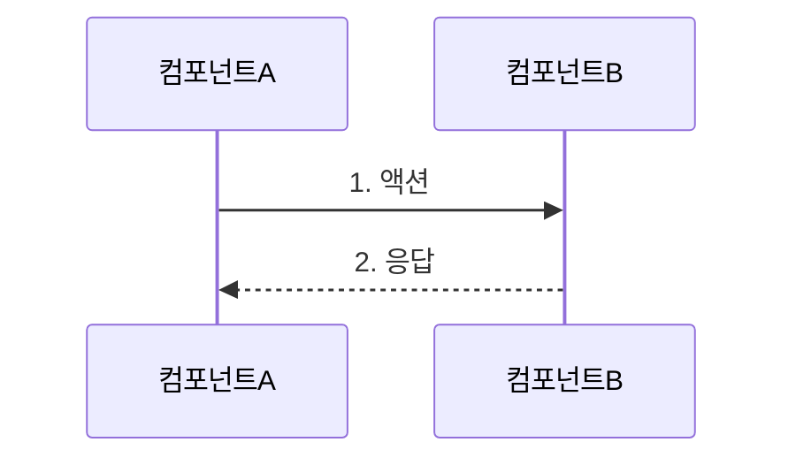
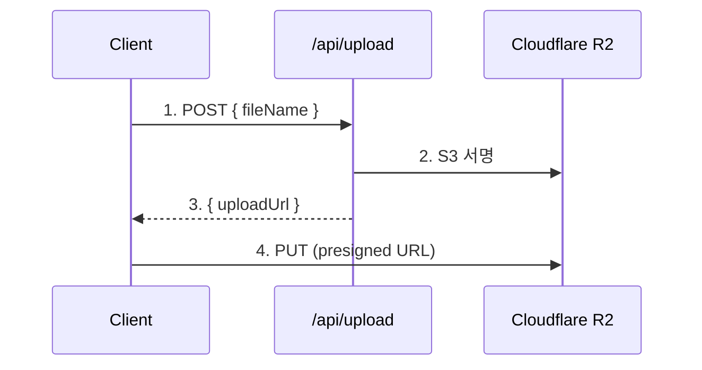
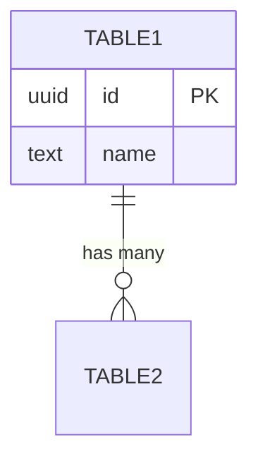
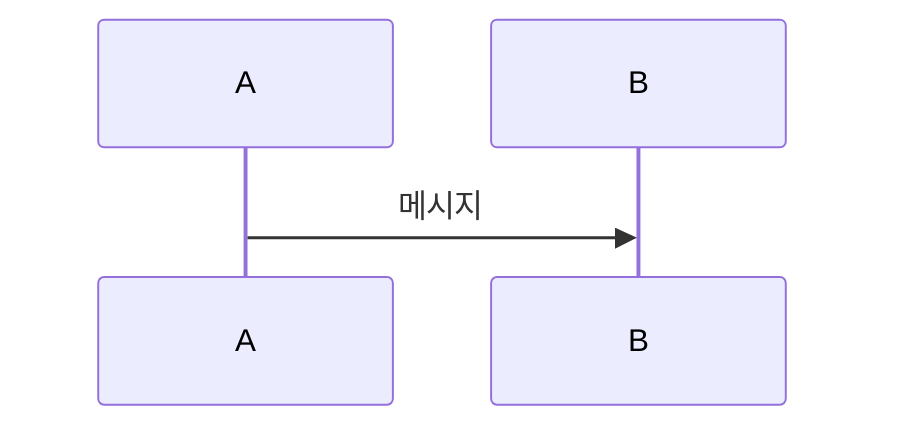
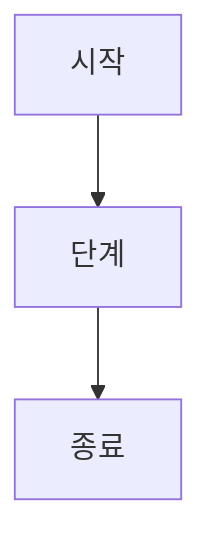
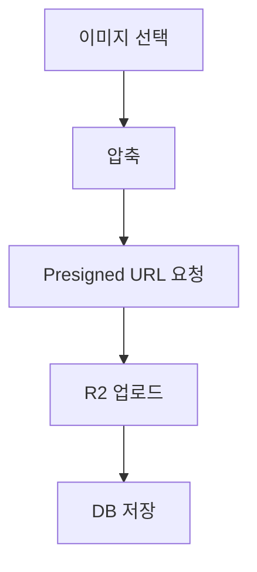
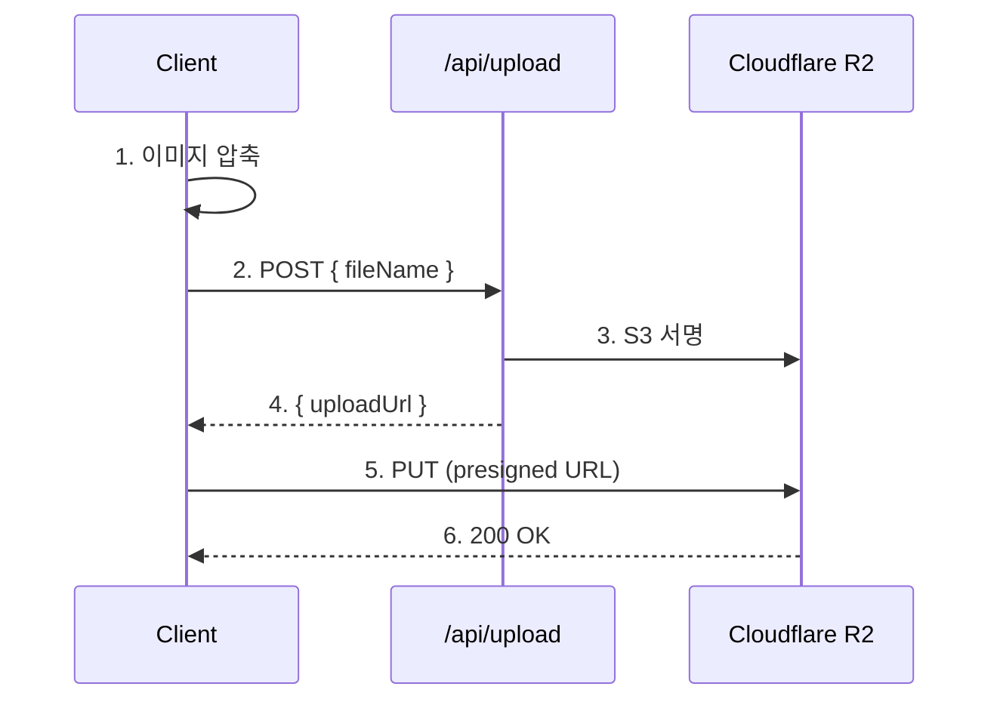

# 기술 문서 작성 가이드

> **Say The Word On Beat KR** 프로젝트의 기술 문서 작성 표준 및 템플릿

---

## 목차

- [1. 개요](#1-개요)
- [2. 문서 구조 원칙](#2-문서-구조-원칙)
- [3. 작성 패턴 및 템플릿](#3-작성-패턴-및-템플릿)
- [4. 필수 요소](#4-필수-요소)
- [5. DB 문서 작성 프로세스](#5-db-문서-작성-프로세스)
- [6. 체크리스트](#6-체크리스트)
- [7. 예제 및 참고](#7-예제-및-참고)

---

## 1. 개요

### 1.1 목적

이 가이드는 프로젝트의 **기술 문서를 일관되게 작성**하기 위한 표준을 정의합니다.

**대상 문서:**
- 데이터베이스 아키텍처 문서
- API 문서
- 설계 패턴 문서
- 마이그레이션 가이드

### 1.2 핵심 원칙 (5C)

| 원칙 | 의미 | 적용 방법 |
|------|------|-----------|
| **Comprehensive** | 포괄적 | 개념부터 실무까지 전 범위 커버 |
| **Concrete** | 구체적 | 추상 설명 금지, 코드/파일 경로 필수 |
| **Connected** | 연결성 | 섹션 간 상호 참조, 파일 링크 |
| **Clear** | 명확성 | 테이블/다이어그램으로 시각화 |
| **Current** | 최신성 | 마이그레이션 이력, deprecated 명시 |

---

## 2. 문서 구조 원칙

### 2.1 전체 구조 (10단계 피라미드)

```
레이어 1: 개념 (What) - 무엇을?
  └─ 1. 소개 및 개요
  └─ 2. 핵심 구조 (테이블/스키마/API)
  └─ 3. 아키텍처 (Storage/Auth 등)

레이어 2: 구현 (How) - 어떻게?
  └─ 4. 데이터 접근 패턴
  └─ 5. 보안 및 권한 관리

레이어 3: 심화 (Why) - 왜?
  └─ 6. 타입 안전성
  └─ 7. 주요 설계 패턴

레이어 4: 운영 (Deploy) - 배포?
  └─ 8. 환경 설정 및 마이그레이션

레이어 5: 실무 (Practice) - 실전?
  └─ 9. 실전 코드 예제
  └─ 10. 참고 파일 경로
```

### 2.2 섹션 제목 규칙

```markdown
# 문서 제목 (H1 - 1개만)

## 1. 주요 섹션 (H2 - 번호 포함)

### 1.1 서브섹션 (H3 - 계층 번호)

#### 세부 항목 (H4 - 번호 없음)
```

### 2.3 섹션 구분선

- 주요 섹션(H2) 사이에는 **구분선** `---` 삽입
- 서브섹션(H3) 사이에는 구분선 생략

---

## 3. 작성 패턴 및 템플릿

### 3.1 테이블 설명 패턴

**사용처**: 데이터베이스 테이블, API 엔드포인트 등

```markdown
#### `테이블명` 또는 엔티티명

한 줄로 핵심 설명.

| 컬럼명/필드명 | 타입 | 제약조건 | 기본값 | 설명 |
|---------------|------|----------|--------|------|
| `id` | UUID | PRIMARY KEY | `gen_random_uuid()` | 고유 식별자 |
| `created_at` | TIMESTAMPTZ | NOT NULL | `now()` | 생성 시각 |

**인덱스** (데이터베이스인 경우):
- `idx_xxx_yyy`: 용도 설명

**제약조건** (필요시):
- **UNIQUE** (`col1`, `col2`): 중복 방지 설명
- **CHECK**: 조건 설명

**특징** (항상):
- 핵심 포인트 1
- 핵심 포인트 2
```

**실제 예시:**

```markdown
#### `challenges` 테이블

챌린지의 모든 정보를 저장하는 핵심 테이블입니다.

| 컬럼명 | 타입 | 제약조건 | 기본값 | 설명 |
|--------|------|----------|--------|------|
| `id` | UUID | PRIMARY KEY | `gen_random_uuid()` | 챌린지 고유 ID |
| `title` | TEXT | NOT NULL | - | 챌린지 제목 |
| `is_public` | BOOLEAN | NOT NULL | `false` | 공개 여부 |

**인덱스**:
- `idx_challenges_creator_id`: creator_id 기반 빠른 조회

**특징**:
- 5라운드 × 8슬롯 구조
- 복합 타입(`game_config_struct[]`) 사용
```

---

### 3.2 함수/RPC/API 설명 패턴

**사용처**: 데이터베이스 함수, API 엔드포인트, 유틸리티 함수

```markdown
#### `함수명(파라미터 타입)`

**목적**: 한 줄로 무엇을 하는지 설명

**파일**: [src/path/to/file.ts](src/path/to/file.ts) (선택사항)

```언어
코드 블록
```

**특징**:
- **키워드**: 설명
- **키워드**: 설명

**사용 예제**:

```typescript
// 실제 사용 코드
const result = await functionName(params);
```

**파라미터** (필요시):

| 파라미터 | 타입 | 필수 | 설명 |
|----------|------|------|------|
| `param1` | string | O | 설명 |
| `param2` | number | X | 설명 (기본값: 0) |

**반환값** (필요시):

| 필드 | 타입 | 설명 |
|------|------|------|
| `id` | string | 생성된 ID |
```

**실제 예시:**

```markdown
#### `increment_view_count(row_id UUID)`

**목적**: 챌린지 조회수를 원자적으로(atomic) 증가시킵니다.

```sql
CREATE OR REPLACE FUNCTION public.increment_view_count(row_id UUID)
RETURNS void
LANGUAGE plpgsql
SECURITY DEFINER
AS $$
BEGIN
  UPDATE public.challenges
  SET view_count = view_count + 1
  WHERE id = row_id;
END;
$$;
```

**특징**:
- **SECURITY DEFINER**: postgres 권한으로 실행 (RLS 우회)
- **Atomic 업데이트**: 동시 요청에도 정확한 카운팅 보장

**사용 예제**:

```typescript
const { error } = await supabase.rpc("increment_view_count", {
  row_id: challengeId,
});
```
```

---

### 3.3 문제-해결 패턴 (설계 패턴)

**사용처**: 설계 결정, 아키텍처 선택, 기술 선택 설명

```markdown
### N. 패턴명 또는 기술명

**문제**: 해결하려는 문제를 명확히 설명

**해결책**:

1. 단계 1 설명
2. 단계 2 설명
3. 단계 3 설명

(또는 코드/다이어그램)

**장점**:
- 장점 1
- 장점 2
- 장점 3

**단점** (선택사항):
- 단점 또는 트레이드오프
```

**실제 예시:**

```markdown
### 1. Presigned URL 보안 패턴

**문제**: 클라이언트가 R2에 직접 업로드하려면 서비스 키가 필요하지만, 브라우저에 노출할 수 없음

**해결책**:

1. 서버가 시간 제한된 서명 URL 생성 (60초)
2. 클라이언트는 서명 URL로만 업로드 (서비스 키 불필요)
3. 서명 URL 만료 후 재사용 불가

**장점**:
- 서비스 키 보호
- 서버 부하 최소화 (직접 업로드)
- 표준 AWS S3 호환 패턴
```

---

### 3.4 플로우/프로세스 설명 패턴

**사용처**: 데이터 흐름, 업로드 프로세스, 인증 플로우 등

```markdown
### 제목

#### 플로우 다이어그램

**플로우**:



#### 단계별 설명

**단계별 프로세스**:

1. **단계명**:
   - 세부사항 1
   - 라이브러리: `library-name`
   - 옵션: `{ key: value }`

2. **단계명**:
   - 세부사항

**핵심 포인트**:
- 중요 포인트 1
- 중요 포인트 2
```

**실제 예시:**

```markdown
### 이미지 업로드 플로우

#### Presigned URL 패턴

**플로우**:



#### 단계별 설명

1. **클라이언트 측 압축**:
   - 라이브러리: `browser-image-compression`
   - 옵션: `maxSizeMB: 0.5`, `quality: 0.7`

2. **Presigned URL 요청**:
   - 엔드포인트: `POST /api/upload/presigned-url`
```

---

### 3.5 타입/인터페이스 설명 패턴

**사용처**: TypeScript 타입, 데이터 구조 설명

```markdown
#### 타입명

**목적**: 타입의 역할 설명

```typescript
type TypeName = {
  field1: string;
  field2: number;
};
```

**필드 설명**:

| 필드 | 타입 | 필수 | 설명 |
|------|------|------|------|
| `field1` | string | O | 설명 |
| `field2` | number | X | 설명 (기본값: 0) |

**사용 예제**:

```typescript
const example: TypeName = {
  field1: "value",
  field2: 42,
};
```
```

---

## 4. 필수 요소

### 4.1 목차

**모든 문서는 목차로 시작**

```markdown
## 목차

- [1. 섹션명](#1-섹션명)
- [2. 섹션명](#2-섹션명)
  - [2.1 서브섹션](#21-서브섹션)
- [3. 섹션명](#3-섹션명)
```

### 4.2 파일 링크

**모든 파일 참조는 마크다운 링크 형식**

```markdown
**파일**: [src/entities/challenge/api/repository.ts](src/entities/challenge/api/repository.ts)

**라인 참조** (선택사항):
[repository.ts:8-31](src/entities/challenge/api/repository.ts#L8-L31)
```

### 4.3 코드 블록

**언어 명시 필수**

```markdown
```typescript
// TypeScript 코드
```

```sql
-- SQL 코드
```

```bash
# Bash 명령어
```

```json
{
  "json": "data"
}
```
```

### 4.4 테이블

**데이터 구조는 테이블로**

```markdown
| 컬럼1 | 컬럼2 | 컬럼3 |
|------|------|------|
| 데이터1 | 데이터2 | 데이터3 |
```

### 4.5 다이어그램 (Mermaid)

**복잡한 관계는 다이어그램으로**

```markdown





```

### 4.6 강조 및 서식

| 용도 | 문법 | 예시 |
|------|------|------|
| **굵게** | `**텍스트**` | **중요** |
| *기울임* | `*텍스트*` | *강조* |
| `코드` | `` `코드` `` | `functionName()` |
| 인용 | `> 텍스트` | > 인용문 |
| 리스트 | `- 항목` | - 항목 |
| 번호 리스트 | `1. 항목` | 1. 항목 |

---

## 5. DB 문서 작성 프로세스

### 5.1 데이터베이스 문서 작성 순서

```bash
1. Supabase 스키마 분석
   ├─ pnpx supabase db diff --schema public
   ├─ 테이블 목록 추출
   ├─ 함수 목록 추출
   └─ 복합 타입 추출

2. 마이그레이션 파일 분석
   ├─ supabase/migrations/*.sql 읽기
   ├─ 시간순 변경 이력 파악
   └─ 테이블 변경 추적

3. 코드베이스 역추적
   ├─ src/entities/*/api/repository.ts
   ├─ src/app/api/*/route.ts
   ├─ 실제 사용 패턴 파악
   └─ React Query 훅 확인

4. 타입 정의 확인
   ├─ database.types.ts 읽기
   ├─ 타입 변환 로직 추적
   └─ Entity 타입 매핑

5. 환경변수 체크
   ├─ .env.example 읽기
   └─ 필수 설정 정리
```

### 5.2 섹션별 작성 가이드

#### 섹션 1: 소개 및 개요

```markdown
## 1. 소개 및 개요

### 프로젝트 소개

프로젝트의 **핵심 기능**을 1-2문장으로 설명

### 기술 스택

- **Database**: 사용 DB (버전 포함)
- **Storage**: 스토리지 시스템
- **Framework**: 프레임워크 (버전)
- **Type Safety**: 타입 시스템
- **Data Fetching**: 데이터 페칭 라이브러리

### 문서의 목적

이 문서는 개발자가 다음을 이해할 수 있도록 돕습니다:

- 포인트 1
- 포인트 2
- 포인트 3
```

#### 섹션 2: 데이터베이스 스키마

```markdown
## 2. 데이터베이스 스키마

### 2.1 테이블 구조

#### `테이블명` 테이블

(테이블 설명 패턴 적용)

### 2.2 복합 타입 (Composite Types)

(있는 경우)

### 2.3 데이터베이스 함수

#### `함수명(파라미터)`

(함수 설명 패턴 적용)

### 2.4 ER 다이어그램

```mermaid
erDiagram
    ...
```
```

#### 섹션 3: 스토리지 아키텍처

```markdown
## 3. 스토리지 아키텍처

### 3.1 스토리지 설정

**기본 정보**:
- **버킷 이름**: 이름
- **Public URL**: URL
- **저장 방식**: 방식

### 3.2 업로드 플로우

(플로우 패턴 적용)

### 3.3 이미지 경로 전략

(경로 변환 로직 설명)
```

#### 섹션 4: 데이터 접근 패턴

```markdown
## 4. 데이터 접근 패턴

### 4.1 Repository Layer

**파일**: [경로](경로)

#### 주요 함수

| 함수명 | 메서드 | 용도 | 반환 타입 |
|--------|--------|------|-----------|
| ... | ... | ... | ... |

### 4.2 API Routes

#### `/api/경로` (METHOD)

(API 설명 패턴 적용)

### 4.3 React Query 통합

(Query Keys, 캐시 전략 설명)
```

#### 섹션 5: 보안 및 권한

```markdown
## 5. 보안 및 RLS 정책

### 5.1 Row Level Security (RLS)

#### `테이블명` 테이블

```sql
CREATE POLICY "정책명"
ON 테이블
FOR 작업
USING (조건);
```

### 5.2 Client vs Server 접근

(클라이언트/서버 분리 설명)
```

#### 섹션 6: 타입 안전성

```markdown
## 6. 타입 안전성 아키텍처

### 6.1 타입 흐름

```
DB Schema → Auto-gen → Entity → App
```

### 6.2 명명 규칙

| 계층 | 규칙 | 예시 |
|------|------|------|
| ... | ... | ... |

### 6.3 타입 생성 명령어

```bash
pnpm gen:types
```
```

#### 섹션 7: 주요 설계 패턴

```markdown
## 7. 주요 설계 패턴

### 1. 패턴명

(문제-해결 패턴 적용)

### 2. 패턴명

...
```

#### 섹션 8: 환경 설정

```markdown
## 8. 환경 설정 및 마이그레이션

### 8.1 환경변수

**파일**: [.env.example](.env.example)

```bash
# 카테고리
VAR_NAME=value  # 설명
```

### 8.2 마이그레이션 타임라인

| 순번 | 파일명 | 날짜 | 내용 |
|------|--------|------|------|
| ... | ... | ... | ... |
```

#### 섹션 9: 실전 코드 예제

```markdown
## 9. 실전 코드 예제

### 9.1 예제명

```typescript
// 전체 플로우 코드
```

### 9.2 예제명

...
```

#### 섹션 10: 참고 파일 경로

```markdown
## 10. 참고 파일 경로

### 데이터베이스 & 타입
- [파일명](경로) - 설명

### 엔티티
- [파일명](경로) - 설명

### API 라우트
- [파일명](경로) - 설명
```

---

## 6. 체크리스트

### 6.1 문서 완성도 체크

```markdown
- [ ] 목차 생성 (모든 주요 섹션 링크)
- [ ] 각 테이블마다 상세 설명 (컬럼, 인덱스, 제약조건)
- [ ] ER 다이어그램 포함
- [ ] 모든 함수에 SQL + 사용 예제
- [ ] 플로우는 다이어그램 + 단계별 설명
- [ ] 파일 경로는 마크다운 링크
- [ ] 보안 섹션에서 RLS 정책 명시
- [ ] 타입 변환 로직 (DB → App) 설명
- [ ] 환경변수 테이블 + .env.example
- [ ] 실전 예제 4개 이상 (코드 포함)
- [ ] 마무리 섹션에서 핵심 요약
- [ ] 모든 코드 블록에 언어 명시
- [ ] 테이블 정렬 확인 (마크다운 문법)
```

### 6.2 품질 체크

```markdown
- [ ] 모든 섹션이 독립적으로 읽힐 수 있는가?
- [ ] 개념 → 구현 → 심화 → 운영 → 실무 순서인가?
- [ ] 비개발자도 개념을 이해할 수 있는가?
- [ ] 개발자가 바로 실무에 적용할 수 있는가?
- [ ] 파일 링크가 모두 작동하는가?
- [ ] 코드 예제가 실제 프로젝트 코드인가?
- [ ] 보안 고려사항이 명시되어 있는가?
- [ ] deprecated 요소가 표시되어 있는가?
```

---

## 7. 예제 및 참고

### 7.1 좋은 예시

#### 테이블 설명 (Good)

```markdown
#### `challenges` 테이블

챌린지의 모든 정보를 저장하는 핵심 테이블입니다.

| 컬럼명 | 타입 | 제약조건 | 기본값 | 설명 |
|--------|------|----------|--------|------|
| `id` | UUID | PRIMARY KEY | `gen_random_uuid()` | 챌린지 고유 ID |
| `title` | TEXT | NOT NULL | - | 챌린지 제목 |

**인덱스**:
- `idx_challenges_creator_id`: creator_id 기반 빠른 조회

**특징**:
- 5라운드 × 8슬롯 구조
- 복합 타입 사용
```

#### 테이블 설명 (Bad)

```markdown
#### challenges

챌린지 테이블

| 컬럼 | 타입 |
|------|------|
| id | UUID |
| title | TEXT |

테이블입니다.
```

**문제점**:
- 백틱(`) 없음
- 제약조건, 기본값, 설명 누락
- 인덱스/특징 없음
- 한 줄 설명이 너무 짧음

---

### 7.2 함수 설명 (Good)

```markdown
#### `increment_view_count(row_id UUID)`

**목적**: 챌린지 조회수를 원자적으로 증가시킵니다.

```sql
CREATE OR REPLACE FUNCTION public.increment_view_count(row_id UUID)
RETURNS void
LANGUAGE plpgsql
AS $$
BEGIN
  UPDATE public.challenges
  SET view_count = view_count + 1
  WHERE id = row_id;
END;
$$;
```

**특징**:
- **SECURITY DEFINER**: RLS 우회
- **Atomic 업데이트**: 동시 요청 안전

**사용 예제**:

```typescript
await supabase.rpc("increment_view_count", { row_id: id });
```
```

#### 함수 설명 (Bad)

```markdown
#### increment_view_count

조회수 증가 함수

```sql
UPDATE challenges SET view_count = view_count + 1
```
```

**문제점**:
- 파라미터 타입 누락
- 전체 함수 코드 누락 (일부만)
- 특징 설명 없음
- 사용 예제 없음

---

### 7.3 다이어그램 활용 (Good)

```markdown
### 데이터 흐름



**단계별 설명**:

1. **이미지 압축**: `browser-image-compression` 사용
2. **Presigned URL**: 서버에서 60초 서명 생성
3. **R2 업로드**: 클라이언트 직접 업로드
```

#### 다이어그램 활용 (Bad)

```markdown
### 데이터 흐름

1. 이미지 선택
2. 압축
3. 업로드
```

**문제점**:
- 다이어그램 없음 (텍스트만)
- 각 단계 상세 설명 없음
- 라이브러리/기술 스택 명시 없음

---

### 7.4 완전한 섹션 예시

```markdown
## 3. 이미지 업로드 아키텍처

### 3.1 Cloudflare R2 설정

**기본 정보**:

- **버킷 이름**: `say-the-word-on-beat-challenge-images`
- **Public URL**: `https://pub-xxx.r2.dev`
- **저장 방식**: 상대 경로 (예: `uuid.jpg`)
- **CDN 캐싱**: `Cache-Control: public, max-age=31536000`

**마이그레이션 이력**:

- 초기: Supabase Storage
- 현재: Cloudflare R2 (비용 효율성)

---

### 3.2 이미지 업로드 플로우

#### Presigned URL 패턴

**보안 원칙**: 클라이언트는 R2 서비스 키를 알 수 없어야 함

**플로우**:



**단계별 설명**:

1. **클라이언트 측 압축**:
   - 라이브러리: `browser-image-compression`
   - 옵션: `maxSizeMB: 0.5`, `quality: 0.7`
   - Web Worker 사용

2. **Presigned URL 요청**:
   - 엔드포인트: `POST /api/upload/presigned-url`
   - 파라미터: `{ fileName: string, contentType: string }`

3. **서버 측 서명**:
   - AWS SDK S3Client로 R2 연결
   - UUID 기반 파일명 생성
   - 60초 만료 시간 설정

4. **클라이언트 직접 업로드**:
   - Presigned URL로 PUT 요청
   - 서버 리소스 사용 없음

**보안 고려사항**:

1. **서비스 키 보호**:
   - `R2_ACCESS_KEY_ID`는 서버 환경변수만
   - 클라이언트 절대 접근 불가

2. **Presigned URL 만료**:
   - 60초 후 자동 만료
   - 토큰 탈취 리스크 최소화

---

### 3.3 이미지 압축

**파일**: [src/shared/lib/image/compression.ts](src/shared/lib/image/compression.ts)

```typescript
import imageCompression from "browser-image-compression";

const COMPRESSION_OPTIONS = {
  maxSizeMB: 0.5,
  maxWidthOrHeight: 1280,
  quality: 0.7,
  useWebWorker: true,
};

export async function compressImage(file: File): Promise<File> {
  return await imageCompression(file, COMPRESSION_OPTIONS);
}
```

**압축 효과**:
- 원본: 평균 3-5MB
- 압축 후: 평균 200-400KB
- 품질 저하: 육안으로 거의 구분 불가
```

---

## 8. 마무리

### 8.1 핵심 요약

**이 가이드를 따르면:**

1. **일관된 품질**: 모든 기술 문서가 동일한 수준 유지
2. **빠른 작성**: 템플릿으로 작성 시간 단축
3. **실무 적용**: 개발자가 바로 참고 가능
4. **유지보수**: 구조화되어 업데이트 용이

### 8.2 작성 시 주의사항

- [ ] **독립성**: DATABASE_STORAGE.md 없이도 이 가이드만으로 작성 가능
- [ ] **완전성**: 모든 패턴과 예제를 포함
- [ ] **명확성**: 좋은 예시 vs 나쁜 예시 대비
- [ ] **실용성**: 실제 프로젝트 코드 기반

### 8.3 다음 단계

**새 문서 작성 시:**

1. 이 가이드의 **섹션 5 (DB 문서 작성 프로세스)** 참고
2. **섹션 3 (작성 패턴)** 템플릿 적용
3. **섹션 6 (체크리스트)** 확인
4. **섹션 7 (예제)** 참고하여 품질 검증

**문의 및 기여**:

- 새로운 패턴 추가 시 이 가이드도 업데이트
- 예제는 실제 프로젝트 코드 기반으로만

---

**버전**: 1.0.0
**최종 수정**: 2026-01-04
**작성자**: Claude Code Assistant
